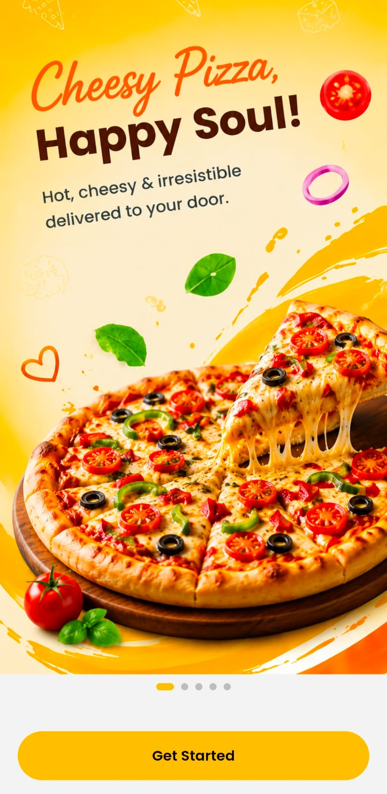
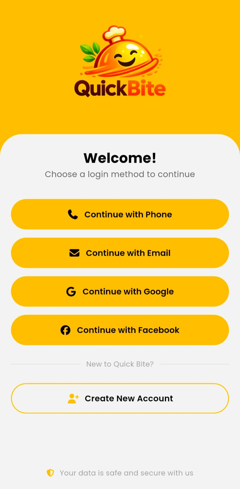
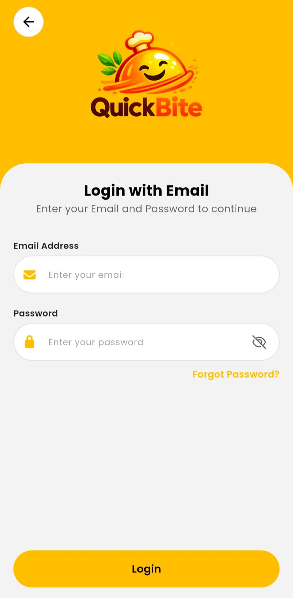
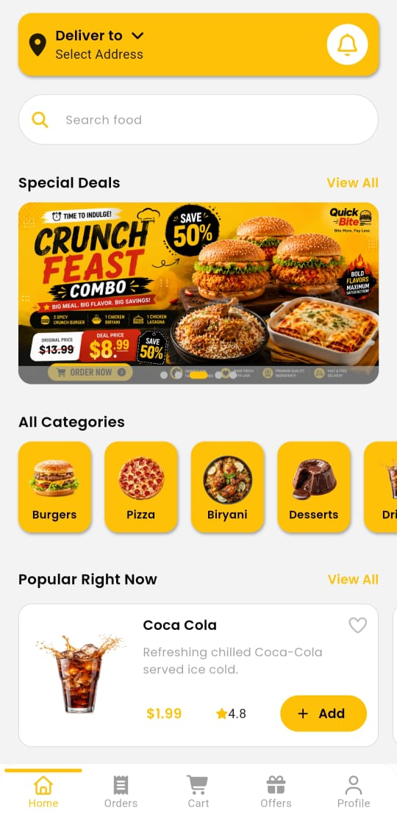
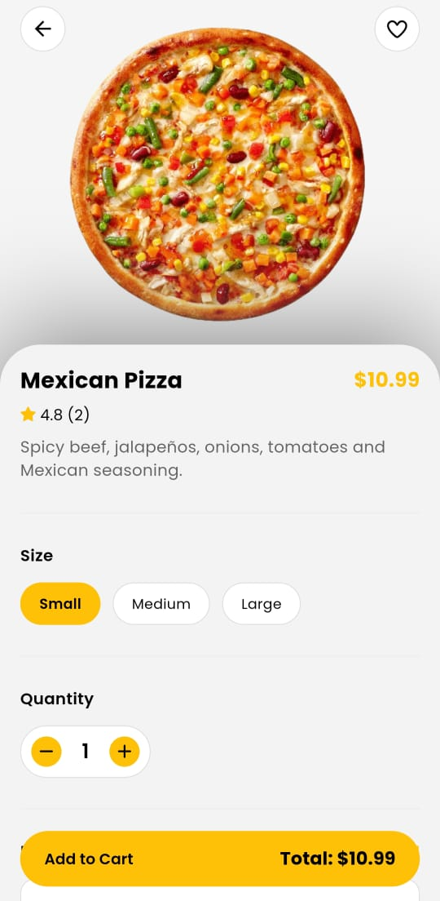
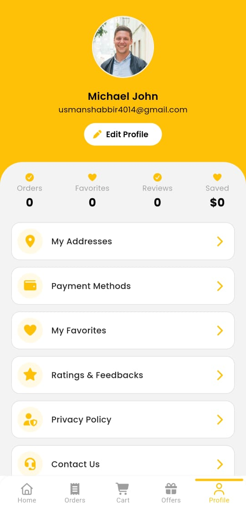
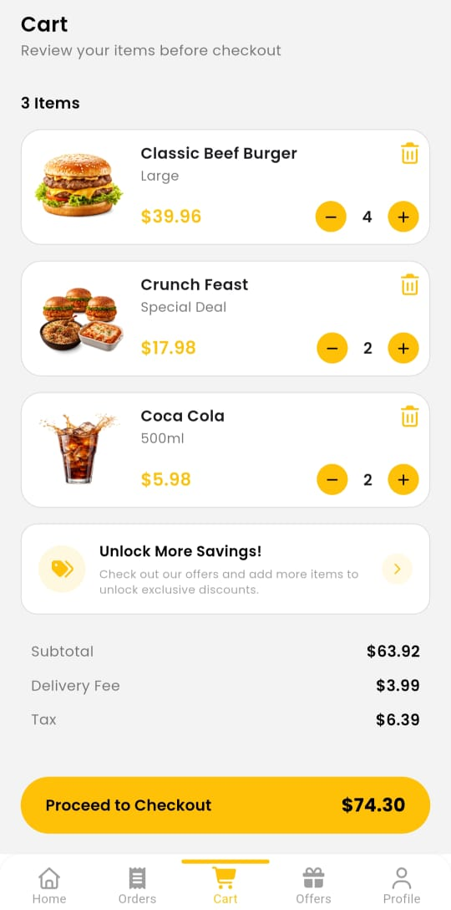
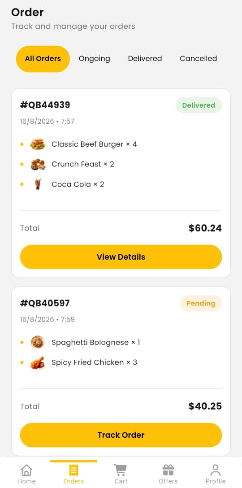

# 🍔 Quick Bite

> A complete Flutter food delivery ecosystem featuring a customer mobile app and a responsive web-based admin panel.

Quick Bite is a full-featured food delivery application built with **Flutter and Firebase**. It demonstrates a complete food ordering workflow, from authentication and browsing products to cart management, checkout, order tracking, rider assignment, reviews, promotions, and administration.

---

## 📱 Screenshots

### 🔐 Authentication

| Onboarding | Login Methods | Email Login |
|---|---|---|
|  |  |  |

### 🛍️ Customer App

| Home | Product Details | Cart |
|---|---|---|
|  |  |  |

### 📦 Order Management

| Orders | Track Order |
|---|---|
|  |  |

---

## 🚀 Features

### 👤 Authentication
- Phone number authentication with OTP
- Email & password authentication
- Google Sign-In
- Facebook Sign-In
- Password reset
- User profile management

### 🍔 Food Ordering
- Browse food categories
- Product details
- Product variants and sizes
- Product ratings and reviews
- Favorites
- Search functionality
- Popular products
- Special deals
- Promotional offers

### 🛒 Cart & Checkout
- Add/remove products
- Increase/decrease quantities
- Product variants
- Automatic subtotal calculation
- Delivery fee calculation
- Tax calculation
- Promotional discounts
- Promo code support
- Payment method selection

### 📦 Order Management
- Place orders
- Real-time order status
- Order history
- Order details
- Order cancellation
- Order tracking timeline
- Rider assignment
- Rider information
- Delivery status

### 📍 Location & Delivery
- Address management
- Multiple saved addresses
- Current location support
- Reverse geocoding
- OpenStreetMap integration
- 10 KM delivery radius

### ⭐ Reviews & Ratings
- Product reviews
- Special deal reviews
- App reviews
- Rating system

### 🔔 Notifications
- Order notifications
- Promotional notifications
- Firebase Cloud Messaging support

---

# 🖥️ Admin Panel

Quick Bite includes a separate **Flutter Web Admin Panel** for restaurant management.

### Admin Features

- 📊 Dashboard
- 📦 Order management
- 🛵 Rider management
- 🍔 Category management
- ⭐ Customer reviews
- 🔐 Admin authentication
- 📱 Responsive web interface
- 🔄 Real-time Firebase data

### Order Management

Administrators can manage the complete order lifecycle:

```text
Pending
   ↓
Confirmed
   ↓
Preparing
   ↓
Ready
   ↓
On The Way
   ↓
Delivered